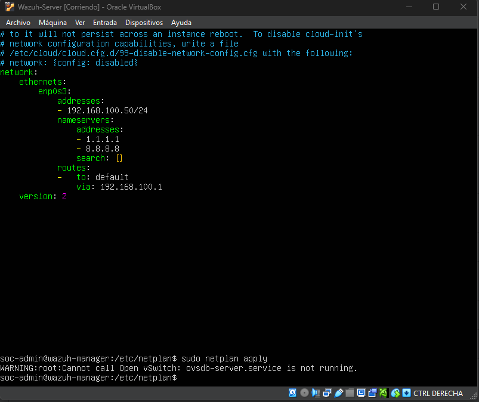
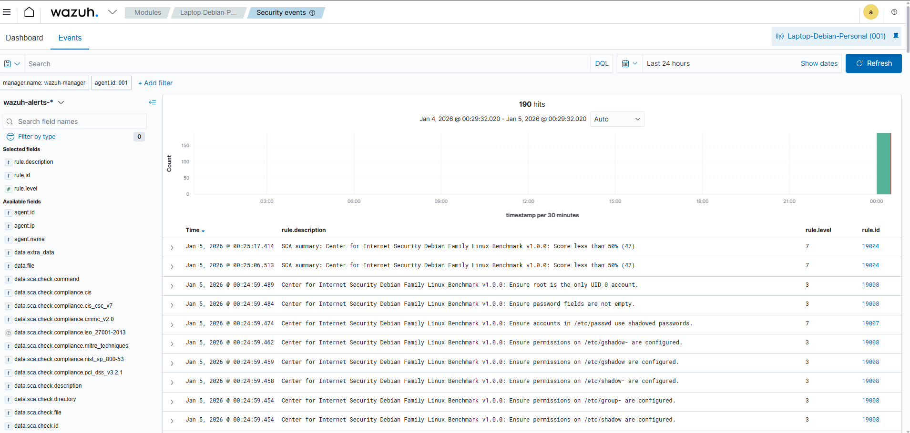
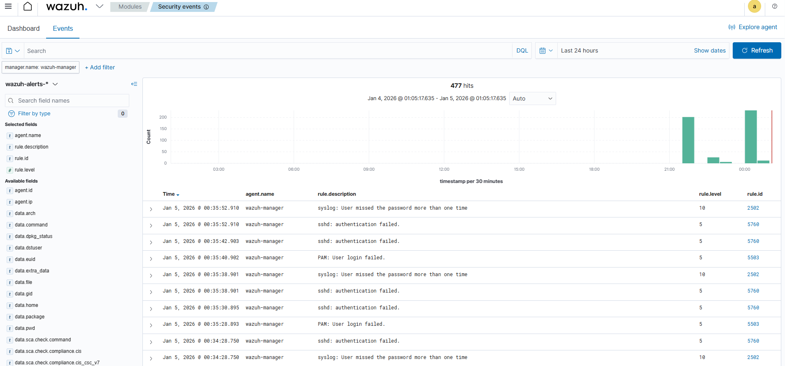
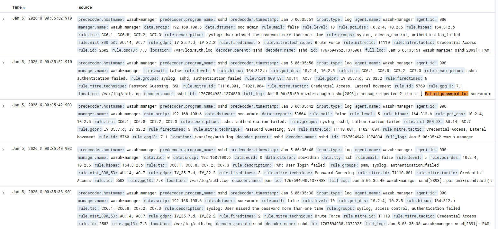

# SOC Lab: Implementación de SIEM/XDR con Wazuh.

Este proyecto documenta el despliegue de un SOC a escala integrando un servidor Wazuh Manager para el monitoreo proactivo de un endpoint Debian 12.

## Infraestructura y configuración de red.

Para garantizar la estabilidad del SIEM en un entorno virtualizado, se implementaron configuraciones de red persistentes para evitar la pérdida de telemetría por cambios de direccionamiento IP.

- **Red:** Adaptador Puente (Bridge) para visibilidad en capa 2 entre la VM y el host físico.
- **Persistencia:** Configuración de *Netplan* y desactivación de `cloud-init` para fijar la IP estática 192.168.100.50 a fin de que se maneje a nivel de red pública.

**Evidencia de configuración:** 

 

*Archivo de configuración YAML de Netplan validando la dirección IP estática y los servidores DNS utilizados.*

## Auditoría de cumplimiento (SCA)

Utilizando el módulo de **Security Configuration Assesment (SCA)**, se realizó un escaneo del endpoint basado en los estándares de la industria para identificar vectores de ataque proactivamente.

- **Benchmark:** CIS (Center for Internet Security) Debian Family Linux.
- **Hallazgos:** Se identificaron configuraciones críticas fuera de norma, resultando en un score de cumplimiento inferior al 50% (47). Se detectaron permisos inseguros en archivos sensibles como `/etc/shadow`y `/etc/gshadow`

**Panel de auditoría:** 

*Resumen de cumplimiento y la lista de verificaciones fallidas en archivos críticos del sistema.*

## Detección de incidentes: Brute-Force

Se simuló un escenario de ataque mediante múltiples intentos de acceso no autorizado. El motor de reglas de Wazuh demostró su capacidad de correlación de eventos en tiempo real.

- **Técnica detectada:** MITRE ATT&CK T1110.001 (Password Guessing)
- **Correlación:** El SIEM elevó la severidad a **Nivel 10** tras detectar la recurrencia de fallos de autenticación (regla: *User missed the password more than one time*).

**Visualización de la alerta crítica**

*Histogramas y logs detallando la elevación de nivel de la alerta tras múltiples fallos de autenticación detectados por los servicios SSH y PAM.*

## Análisis forense y Triaje

Se utilizó el módulo **Discover** para inspeccionar el log crudo enviado por el agente, permitiendo un análisis granular del incidente.

- **Análisis de datos:** Identificación de la IP de origen del ataque y el usuario objetivo (`soc-admin`)
- **Valor técnico:** Proporciona la evidencia necesaria para la creación de indicadores de compromiso (IoCs) y mapeo directo con el framework MITRE ATT&CK.

**Inspección de logs**

*Desglose técnico del log crudo donde se observa el decodificador utilizado y el mapeo táctico*
